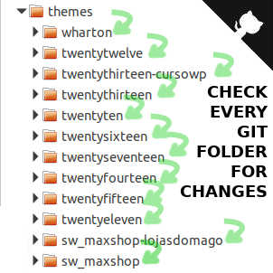

git-multi-status-recursive-commit-and-push
==========

# Installation

sudo ./install.sh

## git-multi-status
Show uncommited changes in git directories and ask if you want to commit and push to origin master

## git-multi-pull
Scan folders to pull each

## gacr
The commands simples does
1. Git add --all
2. Git commit -m "YOU ENTER DESCRIPTION IN SHELL"
3. Git push origin master